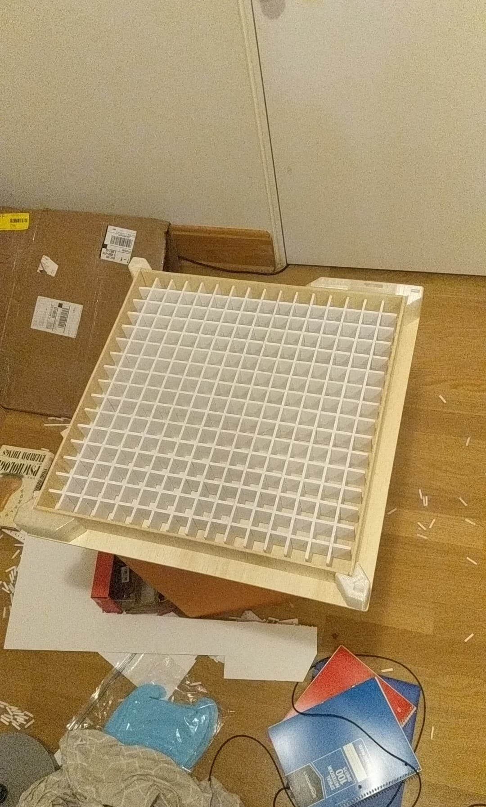
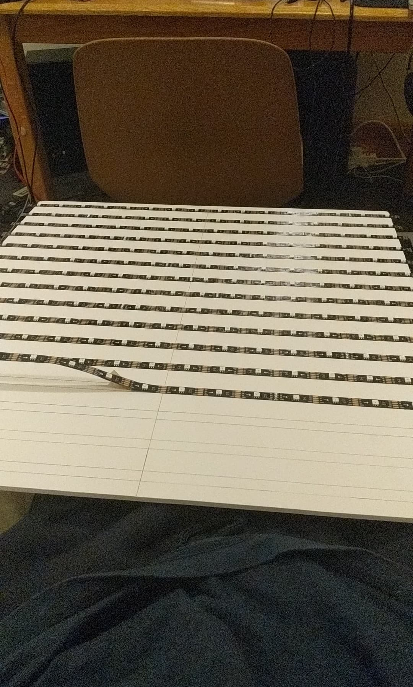

# Smart Album Cover: A Beautiful Display of Music
A Summer of Making Project by Addison and Patrick. 

**Funded by GitHub through Hack Club.**

### A Note About the Code
As of right now, the code contains both NodeJS files and Python files. Since I'm better in JS, I started by writing most in JS then switched to Python.

The `./testscripts/` folder contains most individual components of the application to be tested all at once. It is no longer maintained.

The `./nodetest/` folder is for the initial testing of the Audd.io API. It is no longer maintained.

## About
This is a repository dedicated to the smart album cover display. 

Running on a Raspberry Pi, this recognizes the live music playing and displays it on a 16x16 grid made with LED strips.

### Usage
Create an Audd.io API Key and place it in `key`. You can use "test" as the key for up to 10 instances.

After installing all packages, run the following commmand:
```bash
$ python3 index.py
```
If that causes a permissions error, run
```bash
$ sudo python3 index.py
```

### The Software 

Python script records live audio, then uses the [audd.io](https://audd.io) service for music recognition.

Then sets the pixels to whatever the album cover receives.

### The Hardware




See more at [The Lab](https://thelab.gallery/user/AddisonHenikoff)
